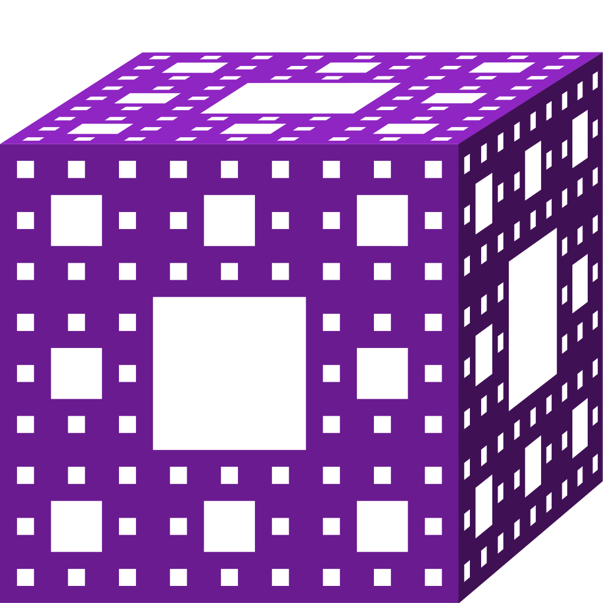

[![Contributors][contributors-shield]][contributors-url]
[![Forks][forks-shield]][forks-url]
[![Stargazers][stars-shield]][stars-url]
[![Issues][issues-shield]][issues-url]
[![Unlicense License][license-shield]][license-url]
<!-- [![Codecov][codecov-shield]][actions-url]
[![Tests][tests-shield]][actions-url] -->

<!-- PROJECT LOGO -->
 

  

  <h2 align="center">Bloxoff Engine</h2>

  

    open source c++ game engine based on OpenGL
     
    <a href="https://github.com/kretoffer/bloxoff-engine/tree/main/docs"><strong>Explore the docs »</strong></a>
     
     
    <a href="https://github.com/kretoffer/bloxoff-engine/issues/new?labels=bug&template=BUG-REPORT.yml">Report Bug</a>
    &middot;
    <a href="https://github.com/kretoffer/bloxoff-engine/issues/new?labels=enhancement&template=FEATURE-REQUEST.yml">Request Feature</a>
  

<!-- ABOUT THE PROJECT -->
## About The Project
This project is an open-source C++ game engine built on top of OpenGL, designed to provide developers with a lightweight, flexible, and modern foundation for creating 2D and 3D games.

### Key Features
<!-- * Modular architecture for easy customization and extension -->
* Real-time rendering powered by OpenGL
* Support for <!--both 2D and -->3D graphics 
* Basic physics and input handling
* Asset management system for textures, models, and shaders
* Cross-platform compatibility (Windows, Linux, macOS)

### Goals
* Provide a clean and well-documented codebase for learning and experimentation
* Enable rapid prototyping and development of indie games
* Foster a collaborative community around open-source game development

<!-- ### Demo
 -->

### Built With
The engine is written in c++ using OpenGl for real-time graphics rendering.

* 
* 

<!-- ROADMAP -->
## Roadmap

See the [open issues](https://github.com/kretoffer/AI-phrase-classifier/issues) for a full list of proposed features (and known issues).

<!-- LICENSE -->
## License

Distributed under the MIT License. See `LICENSE` for more information.

<!-- MARKDOWN LINKS & IMAGES -->
<!-- https://www.markdownguide.org/basic-syntax/#reference-style-links -->
[contributors-shield]: https://img.shields.io/github/contributors/kretoffer/bloxoff-engine
[contributors-url]: https://github.com/kretoffer/bloxoff-engine/graphs/contributors
[forks-shield]: https://img.shields.io/github/forks/kretoffer/bloxoff-engine.svg?style=flat
[forks-url]: https://github.com/kretoffer/bloxoff-engine/network/members
[stars-shield]: https://img.shields.io/github/stars/kretoffer/bloxoff-engine.svg?style=flat
[stars-url]: https://github.com/kretoffer/bloxoff-engine/stargazers
[issues-shield]: https://img.shields.io/github/issues/kretoffer/bloxoff-engine.svg?style=flat
[issues-url]: https://github.com/kretoffer/bloxoff-engine/issues
[license-shield]: https://img.shields.io/github/license/kretoffer/bloxoff-engine.svg?style=flat
[license-url]: https://github.com/kretoffer/bloxoff-engine/blob/master/LICENSE
[codecov-shield]: https://codecov.io/gh/kretoffer/bloxoff-engine/branch/main/graph/badge.svg
[actions-url]: https://github.com/kretoffer/bloxoff-engine/actions
[tests-shield]: https://github.com/kretoffer/bloxoff-engine/workflows/main/badge.svg
